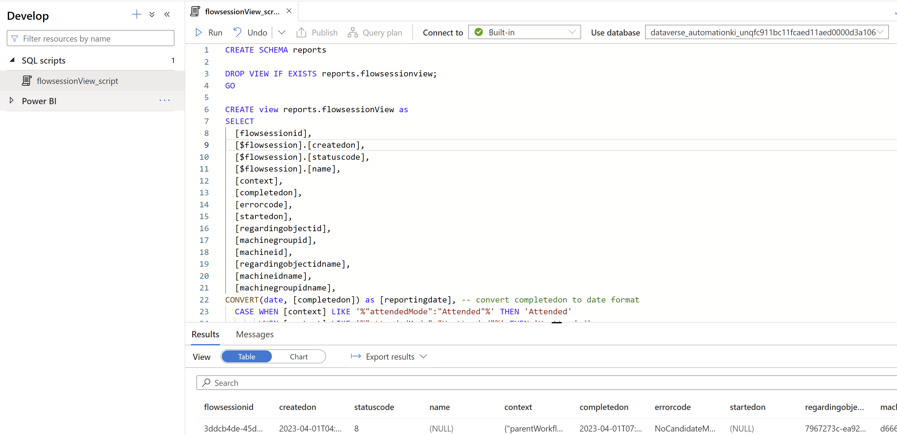
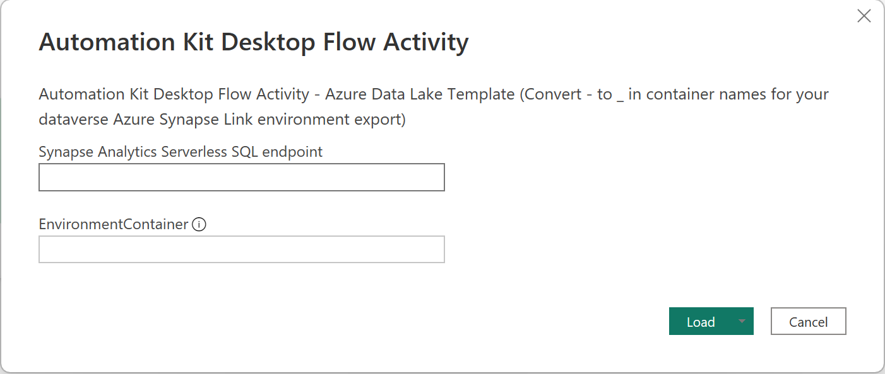
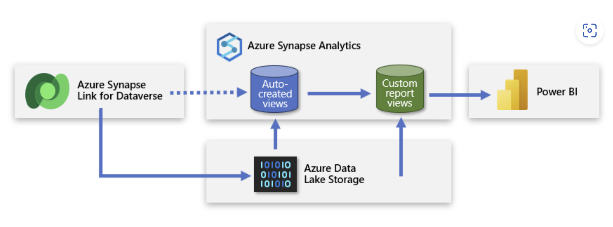

## How to use Power BI report

- Ensure that - [Flow session view](./Scripts/flowsessionview.sql) has been executed using your Azure Synape Workspace. This script is an example custom sql view which you can create in Azure synapse lake DB under a new schema to access it on Power BI. Custom view has been much simplified for better performance to load larger datasets. This view will serve as straightforward, clean sources of data that Power BI connects.

  

- Download the [Power BI template](./Automation-kit-desktopflow-activity.pbit).

- For the Power BI Template enter the required parameter

  

- Copy the Serverless SQL endpoint value from the overview of your Azure Synapse workspace overview from the Azure Portal

  

- Copy the EnvironmentContainer value from the name of the Azure Storage container for the dataverse environment you wish to connect to.

NOTES:

1. You will need to change hyphen (-) characters to underscore (_) character in the name.

2. The EnvironmenContainer will normally be in the format dataverse_<name>_<uniqueid>. For example dataverse_systemadmini_unq123456789abcd1234567890abcdef

- You will need to login with your Active Directory ot Microsoft Account credentials

- Once loaded the dashboard will be available

  

3. Follow the Power BI best practices and guidance for Power platform [here](https://learn.microsoft.com/en-us/power-bi/guidance/powerbi-modeling-guidance-for-power-platform) 

## Best Practices for Large datasets: [Learn more](https://learn.microsoft.com/en-us/power-bi/guidance/powerbi-modeling-guidance-for-power-platform)

### Use import mode with regular/nightly refreshes in Power BI instead of relying on DirectQuery

To improve performance and avoid potential issues with DirectQuery, consider using import mode with regular or nightly refreshes in Power BI. Additionally, Synapse Link Delta Lake will be announced for public preview in the coming weeks, which should offer higher performance for very large datasets.

### Here are some best practices to follow when using import mode in Power BI

1. Set up incremental refresh: This limits the amount of data that needs to be refreshed, speeding up the overall process.

2. Consolidate query logic in a view: This simplifies the process of consuming the data and can improve performance.

3. Use "_partitioned" views to avoid read-write conflicts and deadlocks.

By following these best practices, you can improve the performance and reliability of your Power BI import mode implementation.

  

### Congratulations !! All done. Now you can monitor Desktop flow operational data in Power BI
