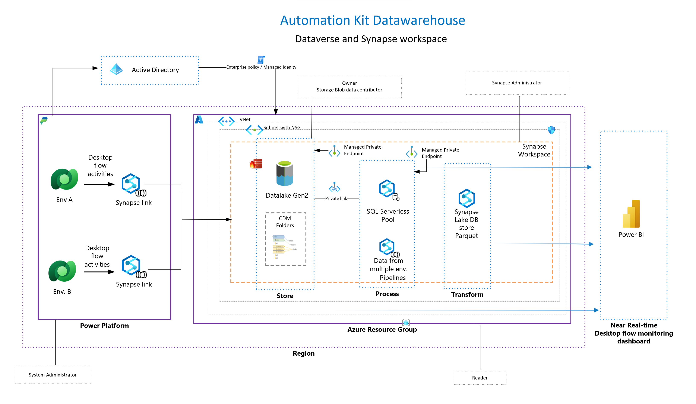

# Desktop Flow Monitoring using Azure Synapse link

This repository provides one-click infrastructure and artifact deployment for Azure Synapse Analytics to get you started with Big Data Analytics on a large sized Desktop flow data. You will learn how to ingest, process, and serve large volumes of data using various components of Synapse.

## Reference Architecture

Dataverse includes the ability to synchronize tables to Azure Data Lake Storage (ADLS) and then connect to that data through an Azure Synapse workspace. With minimal effort, you can set up Azure Synapse Link to populate Dataverse data into Azure Synapse and enable data teams to discover deeper insights.

Azure Synapse Link enables a continuous replication of the data and metadata from Dataverse into the data lake. It also provides a built-in serverless SQL pool as a convenient data source for Power BI queries.

## Contents

- [001- Setup Azure Synapse workspace](./001-Synapse%20Workspace%20Azure%20Setup/readme.md)
- [002- Setup Synapse link in Power Apps](https://github.com/microsoft/powercat-automation-kit/blob/Flow-byodl/AutomationKit_Flow_BYODL/002-%20Synapse%20link%20Setup/readme.md)
- [003- Setup Power BI Dashboard](https://github.com/microsoft/powercat-automation-kit/blob/Flow-byodl/AutomationKit_Flow_BYODL/003-%20Power%20BI%20Dashboard%20Setup/readme.md)
