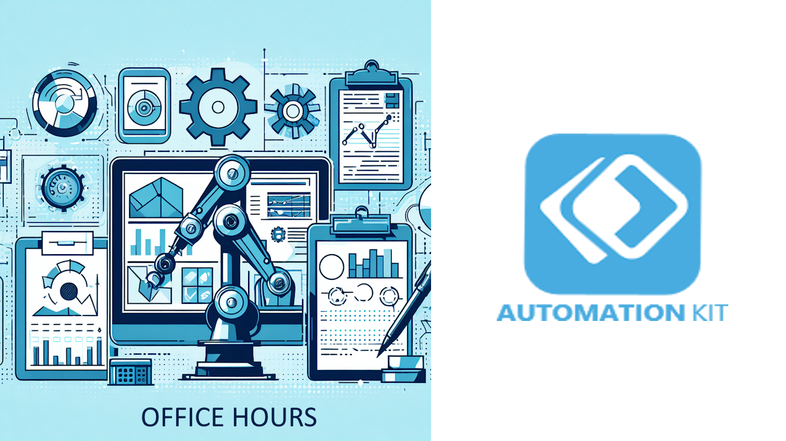

# Office Hours

Join the Automation Kit Office hours held on the second Tuesday of each month between 7:00AM and 8:00AM Pacific time.

[JOIN TEAM CALL NOW](https://aka.ms/AutomationKit/OfficeHours/Join)

[Download calendar file to add to Calendar](./officehours.ics)

## Description

This meeting is a regular open forum for customers and partners to learn and ask questions about the Automation Kit for Power Platform. Come prepared to ask questions about existing features, learn how something works and new features you'd like to see.

Please note:

1. This session will be attended by multiple customers and partners and will be recorded.

2. By attending this session, you consent to the recording being used for public recordings on YouTube. If you do not wish to be recorded, please let us know before the session starts.

3. Please state any questions with the appropriate level of detail for this broader audience.

4. While sections of this may cover introduction or overview session you can leverage our learning content https://aka.ms/AutomationKit to get started.
