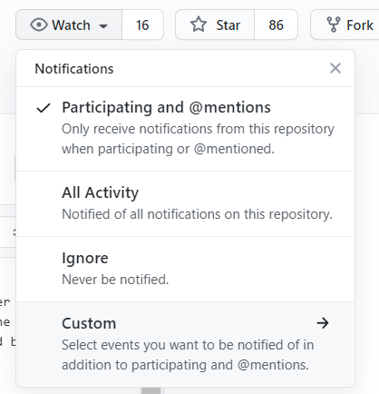
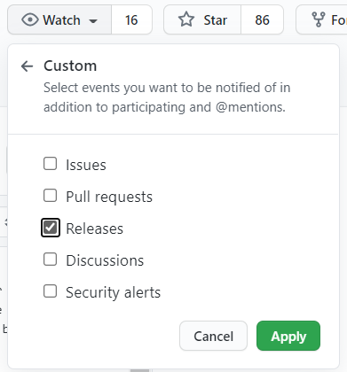

# Automation Kit

 
 

The public preview of the Power CAT Automation Kit for Power Platform supports an automation CoE. The kit provides a set of templates and tools beyond the core Admin controls in the product for organizations to customize how they roll out and manage Power Platform Automation solutions.

The Automation Kit is an open-source project made available via GitHub, built on top of Power Platform, but not coupled with Core Engineering platform investments. This kit relies on Power Automate, Power Apps and Dataverse. These core components require customers who choose to implement the kit to have premium Power Platform licenses. The kit provides with users with the the following artifacts:

1. The canvas app "Automation Project" to support a way to request and submit automation projects for approval.
1. The model driven app "Automation Center" to support the creation and maintenance of automation assets like master data records, mapping resources, environments and assigning roles to employees.
1. Near realtime cloud flows that sync data from satellite environments to the main environment using Dataverse tables. Data is also stored locally (in the satellite environment) and synced with main in near realtime.
1. Power BI dashboard to provide insights and monitor your automation assets.

## Getting Started

Use the [Automation Kit Starter](https://aka.ms/automation-kit-starter) site to navigate your getting started experience.

Refer to the [Automation Kit Learning Guide](https://aka.ms/automation-kit-learn) to reference instructions and setup guidance for the Automation Kit.

Use the [Walkthrough guide videos](./docs/walkthrough.md) that cover prerequisite setup, main and satellite solution setup, configuration data setup. It also includes how to guides on end to end Automation Project setup and the Flow Exception Framework setup.

## Office Hours

:calendar: Register for our [office hours session](https://microsoft.github.io/powercat-automation-kit/office-hours/)

This meeting is a regular forum for customers and partners to learn and ask questions about the Automation Kit for Power Platform. Come prepared to ask questions about existing features, learn how something works and new features you'd like to see. Please note: This session will be attended by multiple customers and partners and will be recorded. Please state any questions with the appropriate level of detail for this broader audience.

This meeting is not an Automation Kit for Power Platform introduction or overview session. If you are looking for an introduction we suggest you start here: [https://aka.ms/automation-kit-learn](https://aka.ms/automation-kit-learn)

We are also unable to do custom troubleshooting or consulting not relevant to a broader audience in this session. If you are experiencing issues with or have questions about the Automation Kit for Power Platform, please don't wait for the call - instead raise your issue or questions via [https://aka.ms/ak4pp-issues](https://aka.ms/ak4pp-issues)

## About this GitHub repo

The Automation Kit GitHub Repo contains the source, releases, issues and backlog items of all components that are part of the Automation Kit.

## Latest Release

The latest shipped version is available via Releases. From there, you can download the latest version of all managed solutions that have been tested and are ready for use.

Stay up to date with our releases by subscribing to them:

Stay up to date with our releases by **subscribing** to them:
1. Select Watch  
      
2. Select Custom > Releases > Apply to receive notifications about our releases 
      

If you want to learn more about what's in the latest release of the Automation Kit, you can check out our  **[closed Milestones](https://github.com/microsoft/powercat-automation-kit/milestones?state=closed)**. This will list both bug fixes as new features that were introduced with the latest version.

If you want to learn more about what the Automation Kit team is planning, check out our **[Open Milestones](https://github.com/microsoft/powercat-automation-kit/milestones?state=open)**. We use Automation Kit - _Month_ 2022 to plan our next release, and Automation Kit - Backlog for our unprioritized feature requests. Please comment or upvote feature requests by using reactions.

## Provide feedback

Visit our starter [feedback](https://microsoft.github.io/powercat-automation-kit/contribution/feedback/) page to discover how to give feedback
## Contribute with Code

If you are interested in contributing to the Automation Kit by fixing issues or adding features please read the [How to Contribute](HOW_TO_CONTRIBUTE.md) guide.

## Setup Instructions and Documentation

Please find all information on how to install and use the kit on [https://learn.microsoft.com/power-automate/guidance/automation-kit/setup/prerequisites](https://learn.microsoft.com/power-automate/guidance/automation-kit/setup/prerequisites)

## Microsoft Open Source Code of Conduct

This project has adopted the [Microsoft Open Source Code of Conduct](https://opensource.microsoft.com/codeofconduct/).

Resources:

- [Microsoft Open Source Code of Conduct](https://opensource.microsoft.com/codeofconduct/)
- [Microsoft Code of Conduct FAQ](https://opensource.microsoft.com/codeofconduct/faq/)
- Contact [opencode@microsoft.com](mailto:opencode@microsoft.com) with questions or concerns

## Trademarks 
This project may contain trademarks or logos for projects, products, or services. Authorized use of Microsoft trademarks or logos is subject to and must follow Microsoft's Trademark & Brand Guidelines. Use of Microsoft trademarks or logos in modified versions of this project must not cause confusion or imply Microsoft sponsorship. Any use of third-party trademarks or logos are subject to those third-party's policies.

## Security

Microsoft takes the security of our software products and services seriously, which includes all source code repositories managed through our GitHub organizations, which include [Microsoft](https://github.com/Microsoft), [Azure](https://github.com/Azure), [DotNet](https://github.com/dotnet), [AspNet](https://github.com/aspnet), [Xamarin](https://github.com/xamarin), and [our GitHub organizations](https://opensource.microsoft.com/).

If you believe you have found a security vulnerability in any Microsoft-owned repository that meets Microsoft's [Microsoft's definition of a security vulnerability](https://docs.microsoft.com/en-us/previous-versions/tn-archive/cc751383(v=technet.10)), please report it to us as described below.

## Reporting Security Issues

**Please do not report security vulnerabilities through public GitHub issues.**

Instead, please report them to the Microsoft Security Response Center (MSRC) at [https://msrc.microsoft.com/create-report](https://msrc.microsoft.com/create-report).

If you prefer to submit without logging in, send email to [secure@microsoft.com](mailto:secure@microsoft.com).  If possible, encrypt your message with our PGP key; please download it from the the [Microsoft Security Response Center PGP Key page](https://www.microsoft.com/en-us/msrc/pgp-key-msrc).

You should receive a response within 24 hours. If for some reason you do not, please follow up via email to ensure we received your original message. Additional information can be found at [microsoft.com/msrc](https://www.microsoft.com/msrc).

Please include the requested information listed below (as much as you can provide) to help us better understand the nature and scope of the possible issue:

  * Type of issue (e.g. buffer overflow, SQL injection, cross-site scripting, etc.)
  * Full paths of source file(s) related to the manifestation of the issue
  * The location of the affected source code (tag/branch/commit or direct URL)
  * Any special configuration required to reproduce the issue
  * Step-by-step instructions to reproduce the issue
  * Proof-of-concept or exploit code (if possible)
  * Impact of the issue, including how an attacker might exploit the issue

This information will help us triage your report more quickly.

If you are reporting for a bug bounty, more complete reports can contribute to a higher bounty award. Please visit our [Microsoft Bug Bounty Program](https://microsoft.com/msrc/bounty) page for more details about our active programs.

## Preferred Languages

We prefer all communications to be in English.

## Policy

Microsoft follows the principle of [Coordinated Vulnerability Disclosure](https://www.microsoft.com/en-us/msrc/cvd).
