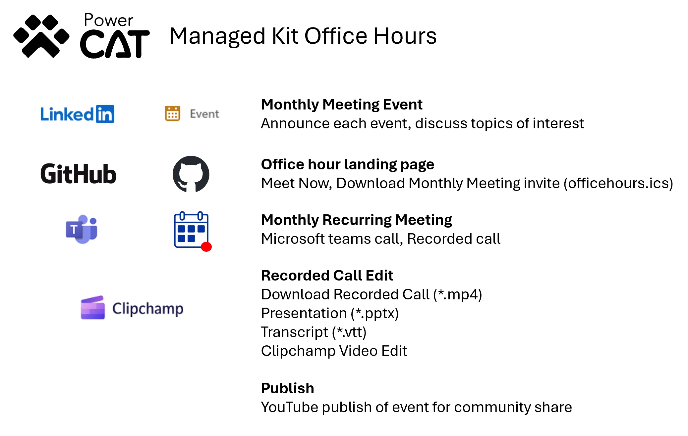

# Overview

This section contains a series of helper automation components that are used to support the office hours for the kit.



  > [!IMPORTANT]
  >
  > This section of the kit is experimental and subject to change as we refine the process over the next set of office hours

## Generating Recurring Invite

The following process is use to create the Microsoft Teams call and public calendar invite to share with the community.

1. The first step in the process is to generate a Microsoft Teams event that people inside the organization and outside the organization can join.

2. Having decided on a recurring day and week of the month generate a public calendar invite

3. Edit the [config.json](./generate/config.json) for settings for the invite like title, description with a link to join the teams call.

4. Edit the [event.json](./generate/config.json) for settings for the invite like start date and timezone.

5. Generate or update the calendar invite

```cmd
cd generate
node install
node generate.js
```

  > [!IMPORTANT]
  > To use the generate command you will need NodeJS installed. Refer to [https://nodejs.org/en/download](https://nodejs.org/en/download) for download instructions.

## Landing Page

The [Office Hours](../../OFFICEHOURS.md) landing page is the common location that is used by LinkedIn Event Invite. Key elements of the page:

- Introduction of what the office hours is
- Link to join the office hours call now
- Link to download Calendar invite so that can attend recurring monthly office hours.

## LinkedIn Event

Each month before the office hours LinkedIn events are a useful way to connect with the community. Key elements of this event post:

- Discussion of topics that will be covered in call
- Setup of Date and Time of the specific monthly call
- Link to the Office Hours Landing page

## Office Hours Meeting

The Microsoft Teams call is available to the public and will be recorded internally each month. Prior to publish an editing process is required to review and edit the video before publishing to the public community video channel.

## Post Meeting Editing

Post edit review of the video is an important step. Key elements of this process are:

- Removal of part of the video while waiting for call to start
- Review of any demo components
- Edit end of video to remove any video after the call completes
- Edit of the video to remove any empty times
- Adjustment of the transcript to the new edited video
- Transformation of Microsoft Teams transcript (*.vtt) to caption format required by video channels (*.srt)
- Creation of new post edit video ready for publish

## Clean up

To clean up from a previous run do to the following

```powershell
.\clean.ps1
```

### Analyze

Read the analyze [README](./analyze/README.md) on how to analyze the video and generate possible edit information for ClipChamp editing stage. At the end of this stage of editing you should have a times.txt in the edit folder that will be used to edit the source video in Clipchamp.

Inputs: mp4 from Team Recording and pptx
Outputs: times.txt

### Edit

Upload, edit and export video in Clipchamp using the edit [README](./edit/README.md). Once complete download the exported video to your PC.

Inputs: mp4 file from analyze folder
Outputs: Download the edited mp4, clipchamp

### Captions

Generate trimmed captions for the exported video from your Microsoft Teams transcript file using the captions [README](./captions/README.md). Once complete upload the captions.srt file with your video.

Inputs: *.clipchamp file from Sharepoint, *.vtt from Teams Recording
Outputs: caption.srt

## Video Publish

Having edited the video the next step is to publish the edited video and closed caption file to video channels to share with community.
